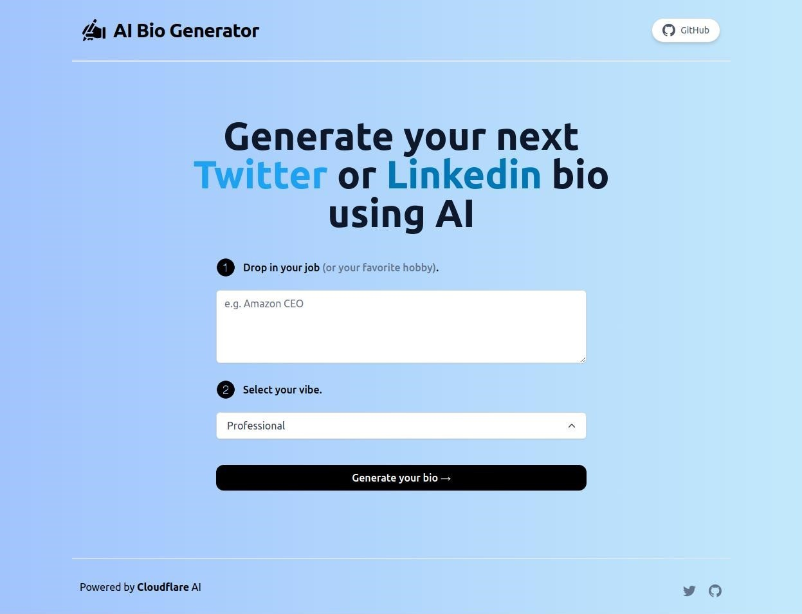

## This project generates Twitter (X) and LinkedIn bios for you using AI.

## How it works

This project uses both [Mixtral 7b Moodel](https://mistral.ai/news/mixtral-of-experts/) to generate a Twitter and LinkedIn bio. It constructs a prompt based on the form and user input, sends it to the Mixtral API on [Cloudflare Worker AI](https://developers.cloudflare.com/workers-ai/), then return the response back to the application.

## Installation Instructions
- Clone this repo `https://github.com/theanilsomani/ai-bio-generator`
- Install Node Modules `npm i`
- Add Cloudflare API token and Cloudflare account ID in a `.env` file
- Run the application on local `npm run dev`

### Repo cloned from [twitterbio.io](https://www.twitterbio.io/)

